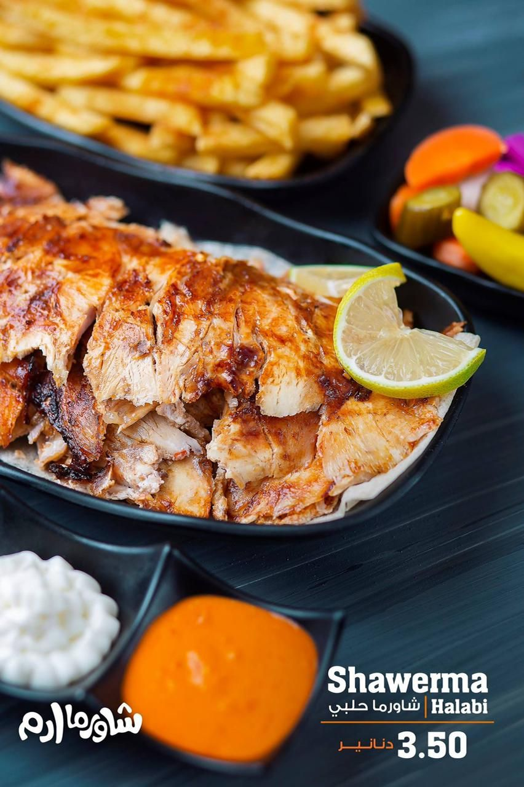
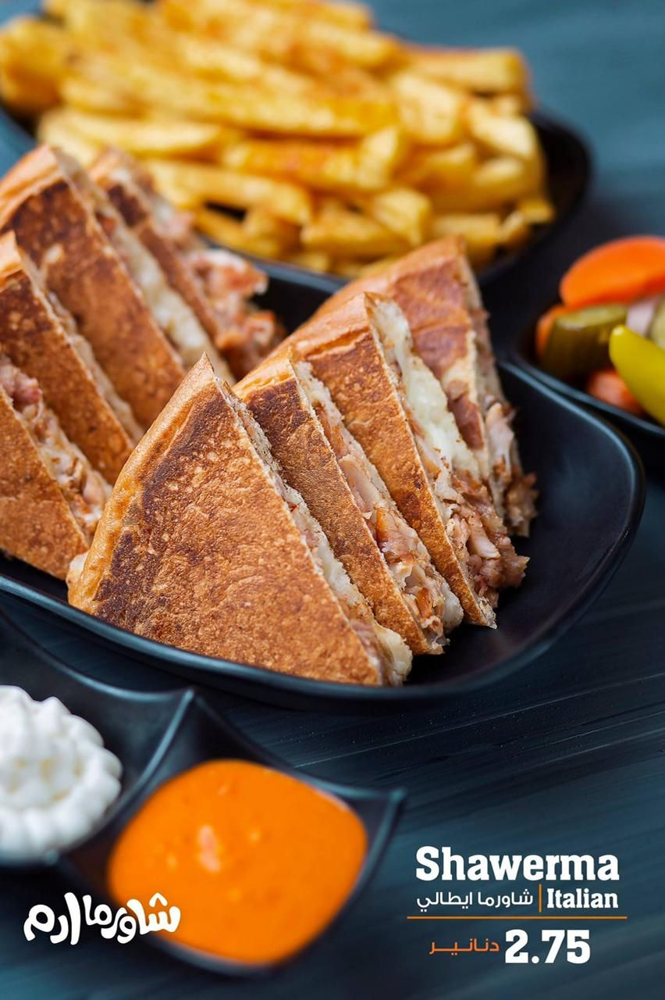
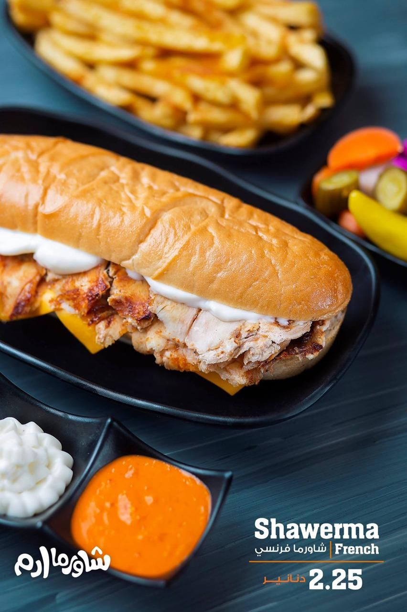
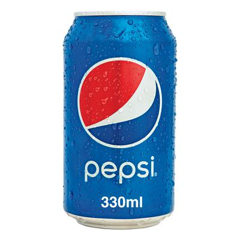
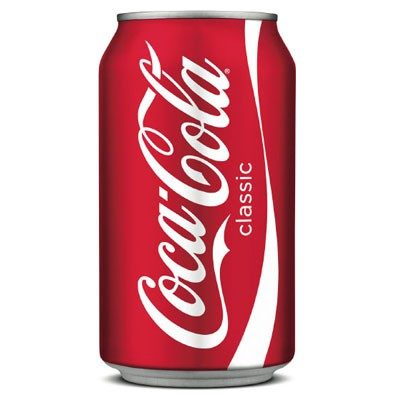

<!DOCTYPE html>
<html style="font-size: 16px;">
  <head>
    <meta name="viewport" content="width=device-width, initial-scale=1.0">
    <meta charset="utf-8">
    <meta name="keywords" content="شاوارما, وجبات​, شاورما حلبي, $3.50, شاورما ايطالي, $4.00, وجبة عادي, $3.00, شاورما خبز لبناني, $24, مشروبات​, فانتا, $0.50, بيبسي, $​0.50, سبرايت, $​0.50, كولا, $​0.50, زورونا على فروعنا, المنيو كامل, للطلب عن طريق الواتس">
    <meta name="description" content="">
    <meta name="page_type" content="np-template-header-footer-from-plugin">
    <title>شاورما</title>
    <link rel="stylesheet" href="nicepage.css" media="screen">
<link rel="stylesheet" href="Home.css" media="screen">
    
    
    <meta name="generator" content="Nicepage 4.10.5, nicepage.com">
    <link id="u-theme-google-font" rel="stylesheet" href="https://fonts.googleapis.com/css?family=Roboto:100,100i,300,300i,400,400i,500,500i,700,700i,900,900i|Open+Sans:300,300i,400,400i,500,500i,600,600i,700,700i,800,800i">
    <link id="u-page-google-font" rel="stylesheet" href="https://fonts.googleapis.com/css?family=Roboto:100,100i,300,300i,400,400i,500,500i,700,700i,900,900i">
    
    
    
    
    
    
    
    
    <meta name="theme-color" content="#eedeeb">
    <meta property="og:title" content="شاورما">
    <meta property="og:description" content="">
    <meta property="og:type" content="website">
  </head>
  <body data-home-page="Home.html" data-home-page-title="Home" class="u-body u-overlap u-overlap-contrast u-overlap-transparent u-xl-mode"><header class="u-clearfix u-header u-sticky u-sticky-f623 u-header" id="sec-02b4">

        
        <nav class="u-align-left u-menu u-menu-dropdown u-nav-spacing-25 u-offcanvas u-menu-1" data-responsive-from="XL">
          

            <a class="u-button-style u-nav-link" href="#" style="font-size: calc(1em + 20px);">
              <svg class="u-svg-link" preserveAspectRatio="xMidYMin slice" viewBox="0 0 302 302" style=""><use xmlns:xlink="http://www.w3.org/1999/xlink" xlink:href="#svg-7b92"></use></svg>
              <svg xmlns="http://www.w3.org/2000/svg" xmlns:xlink="http://www.w3.org/1999/xlink" version="1.1" id="svg-7b92" x="0px" y="0px" viewBox="0 0 302 302" style="enable-background:new 0 0 302 302;" xml:space="preserve" class="u-svg-content"><g><rect y="36" width="302" height="30"></rect><rect y="236" width="302" height="30"></rect><rect y="136" width="302" height="30"></rect>
</g><g></g><g></g><g></g><g></g><g></g><g></g><g></g><g></g><g></g><g></g><g></g><g></g><g></g><g></g><g></g></svg>
            </a>
          

          

            <ul class="u-nav u-unstyled u-nav-1"><li class="u-nav-item"><a class="u-button-style u-nav-link u-text-active-palette-1-base u-text-hover-palette-2-base" href="Home.html" style="padding: 10px 20px;">Home</a>
</li><li class="u-nav-item"><a class="u-button-style u-nav-link u-text-active-palette-1-base u-text-hover-palette-2-base" href="About.html" style="padding: 10px 20px;">About</a>
</li><li class="u-nav-item"><a class="u-button-style u-nav-link u-text-active-palette-1-base u-text-hover-palette-2-base" href="Contact.html" style="padding: 10px 6px 10px 20px;">Contact</a>
</li></ul>
          

          

            

              

                

                <ul class="u-align-center u-nav u-popupmenu-items u-unstyled u-nav-2"><li class="u-nav-item"><a class="u-button-style u-nav-link" href="Home.html">Home</a>
</li><li class="u-nav-item"><a class="u-button-style u-nav-link" href="About.html">About</a>
</li><li class="u-nav-item"><a class="u-button-style u-nav-link" href="Contact.html">Contact</a>
</li></ul>
              

            

            

          

        </nav>
      
</header>
    <section class="skrollable u-clearfix u-image u-parallax u-shading u-section-1" id="sec-c532" data-image-width="750" data-image-height="500">
      

        

          

            <h2 class="u-align-center-xs u-text u-text-default-xs u-text-1">شاوارما</h2>
          

        

      

    </section>
    <section class="u-align-center u-clearfix u-section-2" id="carousel_4448">
      <h1 class="u-text u-text-default u-title u-text-1">وجبات </h1>
      

        

          

            

              <h3 class="u-align-center u-text u-text-default u-text-2">شاورما حلبي</h3>
              
              <h1 class="u-align-center u-text u-text-default u-text-3">$3.50</h1>
              
&nbsp;&nbsp;

            

          

          

            

              <h3 class="u-align-center u-text u-text-default u-text-5">شاورما ايطالي</h3>
              
              <h1 class="u-align-center u-text u-text-default u-text-6">$4.00</h1>
              
&nbsp;&nbsp;

            

          

          

            

              <h3 class="u-align-center u-text u-text-default u-text-8">وجبة عادي</h3>
              
              <h1 class="u-align-center u-text u-text-default u-text-9">$3.00</h1>
              
&nbsp;&nbsp;

            

          

          

            

              <h3 class="u-align-center u-text u-text-default u-text-11">شاورما خبز لبناني</h3>
              
              <h1 class="u-align-center u-text u-text-default u-text-12">$24</h1>
              
&nbsp;&nbsp;

            

          

        

      

      

    </section>
    <section class="u-align-center u-clearfix u-section-3" id="carousel_1cf6">
      

        <h1 class="u-text u-text-default u-title u-text-1">مشروبات </h1>
        

          

            

              

                
                <h2 class="u-align-center-lg u-align-center-md u-align-center-sm u-align-center-xl u-text u-text-default u-text-2">فانتا</h2>
                <h1 class="u-align-center-lg u-align-center-md u-align-center-sm u-align-center-xl u-text u-text-default u-text-3">$0.50</h1>
                
&nbsp;&nbsp;

              

            

            

              

                
                <h2 class="u-align-center-lg u-align-center-md u-align-center-sm u-align-center-xl u-text u-text-default u-text-5">بيبسي</h2>
                <h1 class="u-align-center-lg u-align-center-md u-align-center-sm u-align-center-xl u-text u-text-default u-text-6">$​0.50</h1>
                
&nbsp;&nbsp;

              

            

            

              

                
                <h2 class="u-align-center-lg u-align-center-md u-align-center-sm u-align-center-xl u-text u-text-default u-text-8">سبرايت</h2>
                <h1 class="u-align-center-lg u-align-center-md u-align-center-sm u-align-center-xl u-text u-text-default u-text-9">$​0.50</h1>
                
&nbsp;&nbsp;

              

            

            

              

                
                <h2 class="u-align-center-lg u-align-center-md u-align-center-sm u-align-center-xl u-text u-text-default u-text-11">كولا</h2>
                <h1 class="u-align-center-lg u-align-center-md u-align-center-sm u-align-center-xl u-text u-text-default u-text-12">$​0.50</h1>
                
&nbsp;&nbsp;

              

            

          

        

      

    </section>
    <section class="u-clearfix u-section-4" id="sec-3a5e">
      

        

        

          

            

              

                

                  

                    

                      <h2 class="u-text u-text-1">زورونا على فروعنا</h2>
                      
 Suliman Al Nabulsi St, Amman

                    

                  

                

              

              

                

                  

                    

                      

                        

                          <iframe class="embed-responsive-item" src="//maps.google.com/maps?output=embed&amp;q=jordan%20amman%20&amp;z=14&amp;t=m" data-map="JTdCJTIycG9zaXRpb25UeXBlJTIyJTNBJTIybWFwLWFkZHJlc3MlMjIlMkMlMjJhZGRyZXNzJTIyJTNBJTIyam9yZGFuJTIwYW1tYW4lMjAlMjIlMkMlMjJ6b29tJTIyJTNBMTQlMkMlMjJ0eXBlSWQlMjIlM0ElMjJyb2FkJTIyJTJDJTIybGFuZyUyMiUzQSUyMiUyMiU3RA=="></iframe>
                        

                      

                    

                  

                

              

            

          

        

      

    </section>
    <section class="u-clearfix u-section-5" id="sec-74be">
      

        <h1 class="u-align-center-xs u-text u-title u-text-1">المنيو كامل&nbsp;</h1>
        <a href="files/MENU-PDFFreeDownload.pdf" class="u-align-center-xs u-border-none u-btn u-btn-round u-button-style u-file-link u-hover-grey-70 u-palette-4-dark-1 u-radius-50 u-btn-1">pdf
            
              
            
          
        </a>
        <h1 class="u-align-center-xs u-text u-text-2">للطلب عن طريق الواتس</h1>
        <a href="tel:777 777 777" class="u-align-center-xs u-border-none u-btn u-btn-round u-button-style u-custom-color-1 u-hover-black u-radius-50 u-btn-2">whatsapp 
        </a>
      

    </section>
    <section class="u-clearfix u-grey-5 u-section-6" id="carousel_4a38">
      

        

          

            

              

                

                  

                    <a class="u-social-url" target="_blank" href=""><svg class="u-svg-link" preserveAspectRatio="xMidYMin slice" viewBox="0 0 112 112" style=""><use xmlns:xlink="http://www.w3.org/1999/xlink" xlink:href="#svg-2c4f"></use></svg><svg x="0px" y="0px" viewBox="0 0 112 112" id="svg-2c4f" class="u-svg-content"><circle fill="#3B5998" cx="56.1" cy="56.1" r="55"></circle><path fill="#FFFFFF" d="M73.5,31.6h-9.1c-1.4,0-3.6,0.8-3.6,3.9v8.5h12.6L72,58.3H60.8v40.8H43.9V58.3h-8V43.9h8v-9.2
            c0-6.7,3.1-17,17-17h12.5v13.9H73.5z"></path></svg>
                    </a>
                    <a class="u-social-url" target="_blank" href=""><svg class="u-svg-link" preserveAspectRatio="xMidYMin slice" viewBox="0 0 112 112" style=""><use xmlns:xlink="http://www.w3.org/1999/xlink" xlink:href="#svg-4e10"></use></svg><svg x="0px" y="0px" viewBox="0 0 112 112" id="svg-4e10" class="u-svg-content"><circle fill="#55ACEE" class="st0" cx="56.1" cy="56.1" r="55"></circle><path fill="#FFFFFF" d="M83.8,47.3c0,0.6,0,1.2,0,1.7c0,17.7-13.5,38.2-38.2,38.2C38,87.2,31,85,25,81.2c1,0.1,2.1,0.2,3.2,0.2
            c6.3,0,12.1-2.1,16.7-5.7c-5.9-0.1-10.8-4-12.5-9.3c0.8,0.2,1.7,0.2,2.5,0.2c1.2,0,2.4-0.2,3.5-0.5c-6.1-1.2-10.8-6.7-10.8-13.1
            c0-0.1,0-0.1,0-0.2c1.8,1,3.9,1.6,6.1,1.7c-3.6-2.4-6-6.5-6-11.2c0-2.5,0.7-4.8,1.8-6.7c6.6,8.1,16.5,13.5,27.6,14
            c-0.2-1-0.3-2-0.3-3.1c0-7.4,6-13.4,13.4-13.4c3.9,0,7.3,1.6,9.8,4.2c3.1-0.6,5.9-1.7,8.5-3.3c-1,3.1-3.1,5.8-5.9,7.4
            c2.7-0.3,5.3-1,7.7-2.1C88.7,43,86.4,45.4,83.8,47.3z"></path></svg>
                    </a>
                    <a class="u-social-url" target="_blank" href=""><svg class="u-svg-link" preserveAspectRatio="xMidYMin slice" viewBox="0 0 112 112" style=""><use xmlns:xlink="http://www.w3.org/1999/xlink" xlink:href="#svg-1379"></use></svg><svg x="0px" y="0px" viewBox="0 0 112 112" id="svg-1379" class="u-svg-content"><circle fill="#C536A4" cx="56.1" cy="56.1" r="55"></circle><path fill="#FFFFFF" d="M55.9,38.2c-9.9,0-17.9,8-17.9,17.9C38,66,46,74,55.9,74c9.9,0,17.9-8,17.9-17.9C73.8,46.2,65.8,38.2,55.9,38.2
            z M55.9,66.4c-5.7,0-10.3-4.6-10.3-10.3c-0.1-5.7,4.6-10.3,10.3-10.3c5.7,0,10.3,4.6,10.3,10.3C66.2,61.8,61.6,66.4,55.9,66.4z"></path><path fill="#FFFFFF" d="M74.3,33.5c-2.3,0-4.2,1.9-4.2,4.2s1.9,4.2,4.2,4.2s4.2-1.9,4.2-4.2S76.6,33.5,74.3,33.5z"></path><path fill="#FFFFFF" d="M73.1,21.3H38.6c-9.7,0-17.5,7.9-17.5,17.5v34.5c0,9.7,7.9,17.6,17.5,17.6h34.5c9.7,0,17.5-7.9,17.5-17.5V38.8
            C90.6,29.1,82.7,21.3,73.1,21.3z M83,73.3c0,5.5-4.5,9.9-9.9,9.9H38.6c-5.5,0-9.9-4.5-9.9-9.9V38.8c0-5.5,4.5-9.9,9.9-9.9h34.5
            c5.5,0,9.9,4.5,9.9,9.9V73.3z"></path></svg>
                    </a>
                    <a class="u-social-url" target="_blank" href=""><svg class="u-svg-link" preserveAspectRatio="xMidYMin slice" viewBox="0 0 112 112" style=""><use xmlns:xlink="http://www.w3.org/1999/xlink" xlink:href="#svg-bf16"></use></svg><svg x="0px" y="0px" viewBox="0 0 112 112" id="svg-bf16" class="u-svg-content"><circle fill="#007AB9" cx="56.1" cy="56.1" r="55"></circle><path fill="#FFFFFF" d="M41.3,83.7H27.9V43.4h13.4V83.7z M34.6,37.9L34.6,37.9c-4.6,0-7.5-3.1-7.5-7c0-4,3-7,7.6-7s7.4,3,7.5,7
            C42.2,34.8,39.2,37.9,34.6,37.9z M89.6,83.7H76.2V62.2c0-5.4-1.9-9.1-6.8-9.1c-3.7,0-5.9,2.5-6.9,4.9c-0.4,0.9-0.4,2.1-0.4,3.3v22.5
            H48.7c0,0,0.2-36.5,0-40.3h13.4v5.7c1.8-2.7,5-6.7,12.1-6.7c8.8,0,15.4,5.8,15.4,18.1V83.7z"></path></svg>
                    </a>
                    <a class="u-social-url" target="_blank" href=""><svg class="u-svg-link" preserveAspectRatio="xMidYMin slice" viewBox="0 0 112 112" style=""><use xmlns:xlink="http://www.w3.org/1999/xlink" xlink:href="#svg-b544"></use></svg><svg x="0px" y="0px" viewBox="0 0 112 112" id="svg-b544" class="u-svg-content"><circle fill="#DC4E41" cx="56.1" cy="56.1" r="55"></circle><path fill="#FFFFFF" d="M60.8,76.3c-6.6,8.6-19,11.1-29,7.7c-10.6-3.5-18.4-14.2-18.2-25.5C13,44.6,25.3,31.8,39.1,31.6
            c7.1-0.6,14,2.1,19.3,6.6c-2.2,2.4-4.4,4.8-6.9,7.1c-4.8-2.9-10.4-5-15.9-3.1c-8.8,2.6-14.3,13-10.9,21.8
            c2.7,9.1,13.7,14.1,22.5,10.2c4.5-1.6,7.5-5.7,8.7-10.2c-5.1-0.1-10.2,0-15.5-0.2c0-3,0-6.1,0-9.2c8.6,0,17.1,0,25.7,0
            C66.7,62.3,65.5,70.4,60.8,76.3z M98.3,62.5c-2.6,0-5.1,0-7.7,0c0,2.6,0,5.1,0,7.7c-2.6,0-5.1,0-7.7,0c0-2.6,0-5.1,0-7.7
            c-2.6,0-5.1,0-7.7,0c0-2.6,0-5.1,0-7.7c2.6,0,5.1,0,7.7,0c0-2.6,0-5.1,0.1-7.7c2.6,0,5.1,0,7.7,0c0,2.6,0,5.1,0,7.7
            c2.6,0,5.1,0,7.7,0C98.3,57.3,98.3,59.9,98.3,62.5z"></path></svg>
                    </a>
                  

                

              

            

          

        

        <a href="tel:+962 77 777 777" class="u-active-none u-align-center-xs u-bottom-left-radius-0 u-bottom-right-radius-0 u-btn u-btn-rectangle u-button-style u-hover-none u-none u-radius-0 u-top-left-radius-0 u-top-right-radius-0 u-btn-1"><svg class="u-svg-content" viewBox="0 0 405.333 405.333" x="0px" y="0px" style="width: 1em; height: 1em;"><path d="M373.333,266.88c-25.003,0-49.493-3.904-72.704-11.563c-11.328-3.904-24.192-0.896-31.637,6.699l-46.016,34.752    c-52.8-28.181-86.592-61.952-114.389-114.368l33.813-44.928c8.512-8.512,11.563-20.971,7.915-32.64    C142.592,81.472,138.667,56.96,138.667,32c0-17.643-14.357-32-32-32H32C14.357,0,0,14.357,0,32    c0,205.845,167.488,373.333,373.333,373.333c17.643,0,32-14.357,32-32V298.88C405.333,281.237,390.976,266.88,373.333,266.88z"></path></svg>+962 77 777 777
        </a>
      

  </body>
</html>
